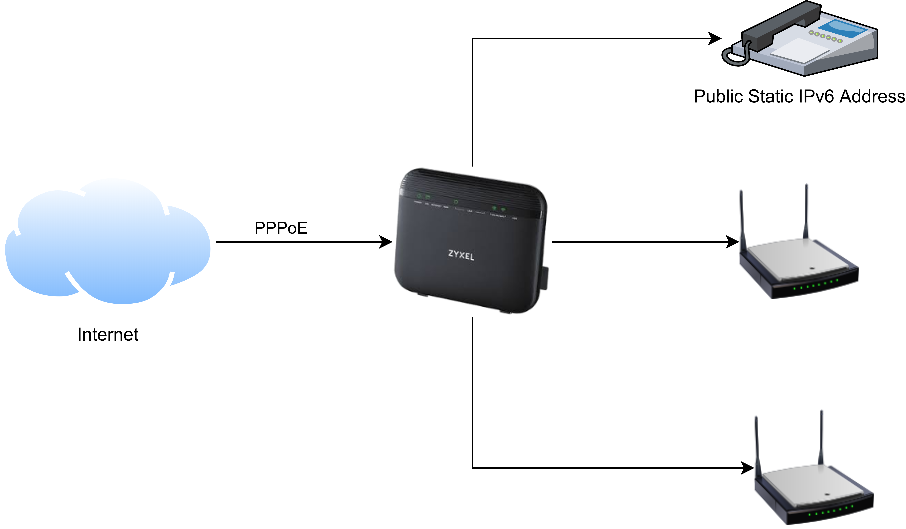

# Creating a 4G WAN Backup with Automated Failover

## Why?

With the recent COVID-19 lockdown, working from home has become more important than ever. With two adults working at home, and a toddler with a YouTube habit, I thought it would be best to introduce a backup WAN link sooner rather than later.

I had also inherited a 3 HomeFi 4G router and contract, which it would seem a shame to not use, although the signal wasn't the best in my house.

I have a static public facing IPv4 address, using NAT with private address space on my local network. I also have a static IPv6 /64 block of addresses routed to my internal network. As I have these I was keen to be able to keep them during failover. This allows me to keep using firewall rules that are in place and also (maybe...) keep TCP connections established during failover.

## Requirements recap
* Backup internet connection
* Automated failover
* With (some) alerting
* Maintaining public IPv4 address, so that outgoing NAT requests come from the same source
* Maintaining incoming routes for our IPv6 addresses

## Original Network

I have a VDSL connection using my ISP supplied Zyxel VMG-3925-B10C router, with WIFI disabled and using separate wireless access points. The router established a PPPoE connection to my ISP and and was then responsible for NAT/routing/firewall. It also ran local network services (DHCP, ND/RA, DNS forwarder)

## Plan

My ISP rather brilliantly provide an L2TP service to allow you to continue to use your allocated address space in case of issues with their VDSL link. They also make it easy for you to use the Zyxel router in bridge mode so that you can assign the WAN addresses to another router.

As such, all I needed was another router that could use the links from the Zyxel and the HomeFi and failover automatically between them.

## Hardware choice

I had come up with requirements for a router:
* L2TP client
* Configurable
* Performant (enough)
* Low power consumption
* Cheap(ish)

I already knew of Ubiquiti and looked into their routers, but they didn't seem to be quite as configurable as I wanted and didn't support an out of the box L2TP client. I started looking into small PCs, but they started to get expensive, or didn't have enough ethernet ports, or had high power consumption. My ISP are heavily involved with [Firebrick] (https://www.firebrick.co.uk/), which look great, but too expensive.

In the end my research led me to Mikrotik, a Latvian manufacturer of a very broad range of networking kit. 

They make an x86 image of their RouterOS operating system available, so I tested this out in a VM first to convince myself that it could do everything I wanted it to. It certainly seemed to!

I took the plunge and bought a hEX 5 port router for about £60. It performs well and does hardware switching. I slightly regretted not buying an hEX S because it has a POE port and an SFP port (that you could put an RJ45 module into for an extra port), but it's not made a big difference.

## Configuration